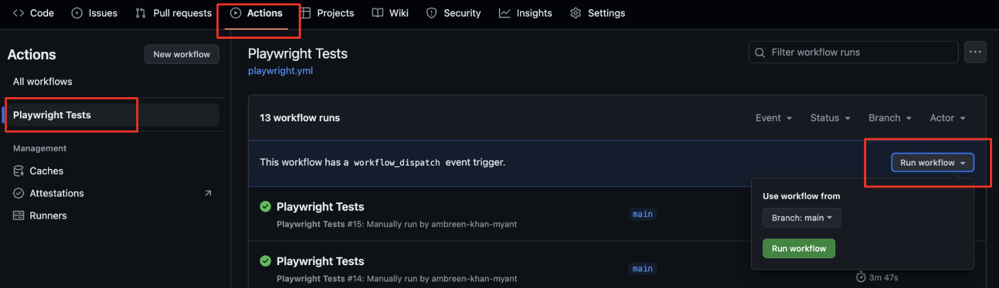
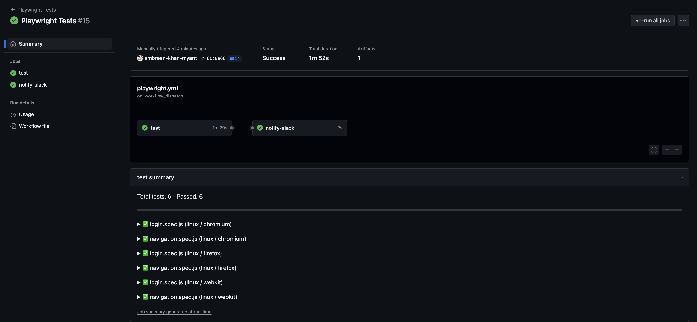
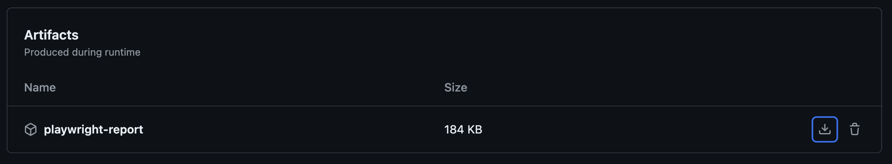
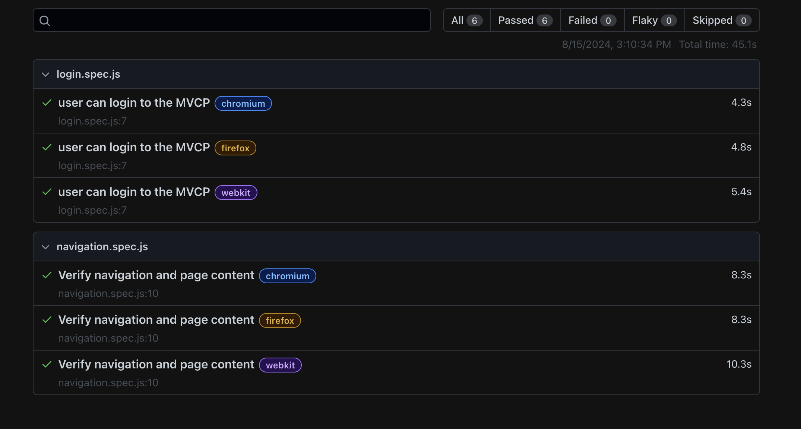

# MVCP - E2E Automation using Playwright - POC

## Running the tests on your local machine

### Step 1: Configure your environment

* [VS Code](https://code.visualstudio.com/)
* [Node](https://nodejs.org/en)
* [Git](https://git-scm.com/download/mac)
* [Homebrew](https://brew.sh/)
* [Playwright extension (Microsoft)](https://marketplace.visualstudio.com/items?itemName=ms-playwright.playwright)

### Step 2: Get the repo
Clone the repo on your local machine.

### Step 3: Install dependencies
Install the dependencies by running the below comannd:
```sh
npm install
```

### Step 4: Install Playwright
If you are running the tests for the first time, please run the following command to download the browsers (we'll be running the test on Chromium, Firefox & Safari): 
```
npx playwright install
```

### Running the tests locally
Now you are ready to run the tests on your local machine. Run the below command on your terminal:

```
npx playwright test --headed
```

You can also run the tests in the headless mode:

```
npx playwright test
```

### Running the tests on demand using GitHub Actions
To run the GitHub action morkflow manually:

1. Go to your GitHub repository.
2. Click on the "Actions" tab.
3. Find the "Playwright Tests" workflow.
4. Click on "Run workflow" dropdown button.
5. Choose the branch you want to run the workflow on and click "Run workflow".



## Viewing the test summary
After the test execution is complete, you can view the test summary by clicking on the summary link in the left navigation menu.



## Viewing the HTML Report
In the Artifacts section click on the playwright-report to download your report in the format of a zip file.



Next, extract the zip file & double click on the index.html file. This will open the latest report in your default browser.



Alternatively, first, extract the zip in a folder that already has Playwright installed. Using the command line change into the directory where the report is and use npx playwright show-report followed by the name of the extracted folder. This will serve up the report and enable you to view it in your browser.

## Data Handling: 

### Data handled using ENV File
Please use `.env` file for the sensitive information such as email & password. (You can rename the env.txt file provided in the repo to `.env` and populate it with your own data.) 

<!-- .env -->
EMAIL=
PASSWORD=

### Other Data
Other data will be populated using JSON files.

## Commands
* Run All Tests in Headless mode: `npx playwright test`
* Show Test Report: `npx playwright show-report`
* Run Tests in Headed Mode: `npx playwright test --headed`
* Start the interactive UI mode: `npx playwright test --ui`
* Runs the tests only on specific browser (e.g. Chrome): `npx playwright test --project=chromium`
* Runs the tests in a specific file (e.g. login.spec.js): `npx playwright test login`
* Runs the tests in debug mode: `npx playwright test --debug`


